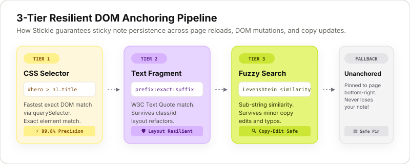
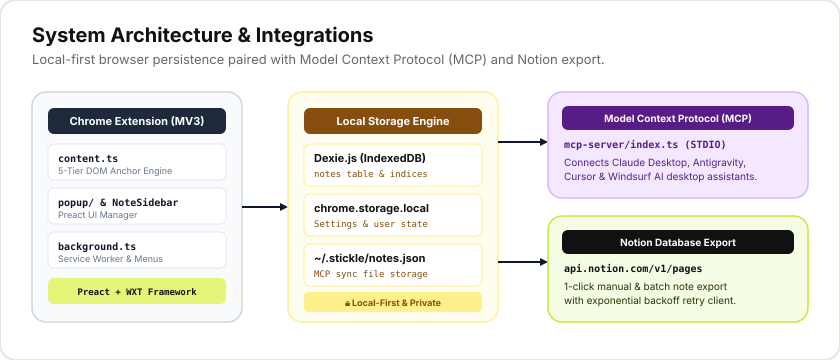

# Stickle — DOM-Anchored Web Sticky Notes


<p align="center">
  
  
  
  
  
  
  
</p>

> A local-first Chrome Extension (MV3) that lets you pin persistent floating sticky notes to dynamic web content using a resilient **3-Tier DOM Anchoring System**.

---

## 📌 Features Overview

- 🎯 **Robust 3-Tier DOM Anchoring**: Notes stay pinned across page refreshes, SPA re-renders, layout refactors, and minor copy edits.
- 🎨 **Figma-Inspired Color System**: Crisp monochrome frame paired with 7 signature color-block surfaces (`lime`, `lilac`, `cream`, `mint`, `pink`, `coral`, `blue`).
- ✍️ **Text Selection Highlighting**: Highlight text ranges on any web page with sticky notes attached directly to the selection.
- ⚡ **Interactive Onboarding**: Automatic first-run interactive sandbox page (`onboarding.html`) to test creating and anchoring notes live.
- 🤖 **Model Context Protocol (MCP) Server**: Built-in STDIO server allowing AI desktop assistants (Claude Desktop, Antigravity, Cursor, Windsurf) to query, search, create, and summarize your web notes directly.
- 🔒 **Local-First & Private**: Notes stored in Chrome Local Storage + IndexedDB via Dexie.js. Zero tracking or telemetry.
- 🚀 **Notion Sync Integration**: 1-click manual note export or batch unsynced export to your Notion database with exponential backoff retries.
- 🔍 **Central Extension Manager Popup**: Search across all saved notes, filter by domain/active tab, date (`Today`, `This Week`, `All Time`), tag management, and focus/open target tabs instantly.
- 🌐 **Web Landing & Waitlist Web App**: Built-in product landing page (`/`) and waitlist app with position estimation, FAQ, and email signup.

---

## 🏗️ 3-Tier DOM Anchoring System

Stickle solves the problem of brittle web annotations on dynamic modern web apps by using a multi-tiered fallback resolution pipeline.



1. **Tier 1 — CSS Selector**: Tries exact DOM matching via optimized CSS selectors (`querySelector`). Fast and precise for stable DOM nodes.
2. **Tier 2 — Text Fragment Quote**: Uses W3C Text Quote matching with exact text, prefix, and suffix contexts. Survives HTML class changes, layout refactors, and framework DOM rebuilds.
3. **Tier 3 — Fuzzy Search**: Uses Levenshtein text similarity matching against page text nodes. Survives minor copy edits, typos, and phrasing tweaks.
4. **Tier 4 — Unanchored Fallback**: If element is deleted or page structure changes completely, the note degrades gracefully to a floating page-level note in the bottom-right corner—never losing your content.

---

## ⌨️ How to Create & Manage Notes

1. **Alt + Click Shortcut**: Hold down `Alt` (or `Option` on macOS) and click any text, element, header, or image on a webpage.
2. **Right-Click Context Menu**: Select any text or right-click anywhere on a webpage and click **📌 Add Stickle Note Here**.
3. **Popup Manager**: Click the Stickle icon in your Chrome toolbar to view, edit, search, or export notes.

---

## 🤖 Model Context Protocol (MCP) Integration

Stickle includes a built-in **Model Context Protocol (MCP)** server (`mcp-server/index.ts`) that allows AI desktop assistants to read, search, create, and aggregate your sticky notes.



### Available MCP Tools

| Tool | Description | Example Arguments |
| :--- | :--- | :--- |
| `list_stickle_notes` | List saved notes filtered by domain, tag, or limit | `{ "domain": "github.com", "limit": 10 }` |
| `search_stickle_notes` | Full-text search across content, page titles, URLs & tags | `{ "query": "typescript", "tag": "research" }` |
| `get_notes_for_url` | Retrieve all notes anchored to a specific webpage URL | `{ "url": "https://wikipedia.org/wiki/React" }` |
| `add_stickle_note` | Create and attach a new sticky note to a target webpage URL | `{ "url": "https://news.ycombinator.com", "content": "..." }` |
| `export_stickle_summary` | Generate a structured Markdown report grouped by site domain | `{ "domain": "wikipedia.org" }` |

### Setting Up MCP with AI Assistants

#### Claude Desktop Configuration (`claude_desktop_config.json`)
Location: `~/Library/Application Support/Claude/claude_desktop_config.json` (macOS)

```json
{
  "mcpServers": {
    "stickle": {
      "command": "npx",
      "args": ["tsx", "/absolute/path/to/stickle/mcp-server/index.ts"]
    }
  }
}
```

#### Antigravity / Cursor / Windsurf MCP Configuration
- **Server Name**: `stickle`
- **Transport**: `stdio`
- **Command**: `npx`
- **Arguments**: `tsx /absolute/path/to/stickle/mcp-server/index.ts`

### Local Data Sync
- The MCP server reads and updates notes stored at `~/.stickle/notes.json` *(or custom path set via `STICKLE_NOTES_PATH`)*.
- Click **Export Notes (.json)** in the extension popup (or Settings) to sync your browser notes to `~/.stickle/notes.json`.

---

## 🛠️ How to Load This Extension in Chrome

1. **Clone repository and install dependencies:**
   ```bash
   pnpm install
   ```
2. **Build the production extension bundle:**
   ```bash
   pnpm build
   ```
3. **Open Google Chrome** and navigate to `chrome://extensions`.
4. **Enable Developer mode** using the toggle switch in the top-right corner.
5. **Click Load unpacked** in the top-left toolbar.
6. Select the `.output/chrome-mv3` folder in this repository.
7. The Stickle extension icon will appear in your Chrome toolbar!

---

## 🧪 Development & Available Scripts

- `pnpm dev` — Run WXT development server with hot module reloading
- `pnpm build` — Build production bundle targeting Chrome MV3 (`.output/chrome-mv3`)
- `pnpm compile` — Execute TypeScript type checking (`tsc --noEmit`)
- `pnpm test` — Run unit, anchoring, Dexie DB & MCP server test suites via Vitest
- `pnpm test:e2e` — Run Playwright browser automation tests
- `pnpm mcp` — Start the Stickle MCP server directly over STDIO
- `pnpm zip` — Package production zip archive for Chrome Web Store submission

---

## 📁 Repository Structure

```
stickle/
├── README.md             # Project documentation & visual guide
├── ARCHITECTURE.md       # Technical design of 3-tier DOM anchoring & sync engine
├── DECISIONS.md          # Architectural & design decisions log
├── DESIGN.md             # Design system specifications & tokens
├── LAUNCH.md             # Chrome Web Store submission & launch checklist
├── ANALYTICS.md          # Privacy-friendly analytics setup
├── wxt.config.ts         # WXT framework & Manifest V3 configuration
├── vercel.json           # Vercel deployment configuration for landing page
├── public/               # Extension icons, favicons & Open Graph images
├── assets/               # Brand assets, SVG diagrams & banners
│   ├── banner.svg
│   ├── anchoring-diagram.svg
│   └── architecture-diagram.svg
├── entrypoints/
│   ├── background.ts     # Service worker (messaging proxy, context menus, onboarding)
│   ├── content.ts        # Content script injected into web pages
│   ├── index/            # Web landing page app (Root /)
│   ├── waitlist/         # Interactive waitlist page app
│   ├── onboarding/       # First-run interactive tutorial & sandbox page
│   ├── popup/            # Extension manager popup app (Preact)
│   └── privacy/          # Privacy policy page
├── lib/
│   ├── db.ts             # Dexie IndexedDB + chrome.storage.local persistence
│   ├── anchoring.ts      # 3-tier DOM anchor resolution engine
│   ├── highlighting.ts   # Text range selection highlight manager
│   ├── notion.ts         # Notion API integration client with retry backoff
│   ├── posthog.ts        # Privacy-respecting opt-in telemetry helper
│   └── types.ts          # Core TypeScript interface definitions
├── components/           # Preact UI components
│   ├── NoteBubble.tsx    # In-page floating sticky note UI & theme picker
│   ├── NoteSidebar.tsx   # Extension popup note list & manager
│   ├── Settings.tsx      # Notion & MCP sync settings panel
│   └── Toast.tsx         # User notification toasts
├── mcp-server/           # Model Context Protocol STDIO server
│   └── index.ts
├── supabase/             # Database migrations & backend functions for waitlist
└── tests/                # Vitest & Playwright test suites
```

---

## 🔒 Privacy & Security

Stickle is built **local-first**. We respect user privacy:
- **Local Storage:** All sticky notes, tags, and preferences remain strictly inside Chrome IndexedDB and `chrome.storage.local`.
- **Zero Telemetry by Default:** No tracking scripts or user data collection in core note storage.
- **Direct API Communication:** Notion export requests travel directly from your browser to Notion's official API (`https://api.notion.com`).
- **Privacy Policy Page:** View our full [Privacy Policy Specification](file:///Users/bhavya/dev/showcase/stickle/entrypoints/privacy/App.tsx) (`privacy.html`).

---

## 📄 License

MIT © Stickle Authors
