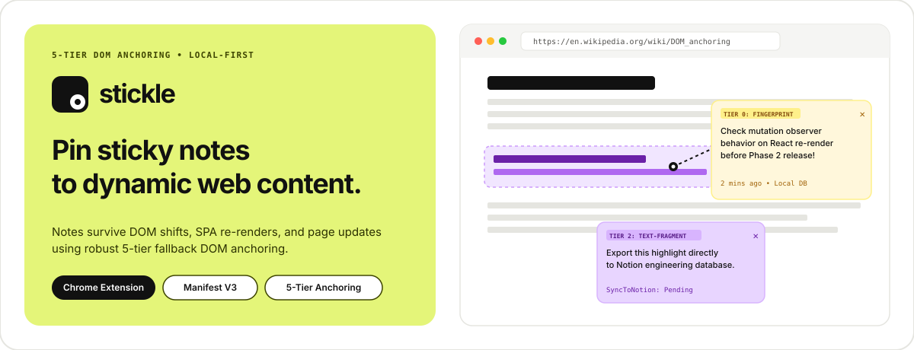

# Stickle — DOM-Anchored Web Sticky Notes



> A local-first Chrome Extension (MV3) that lets you pin floating sticky notes to dynamic web content using a resilient **3-Tier DOM Anchoring System**.

---

## 📌 Features Overview

- 🎯 **Robust 3-Tier Anchoring**: Notes stay pinned across page refreshes, React/Vue DOM re-renders, layout refactors, and minor copy edits.
- 🎨 **Figma-Inspired Aesthetics**: Crisp monochrome frame paired with signature pastel color-block surfaces (`lime`, `lilac`, `cream`, `mint`, `pink`).
- ⚡ **Interactive Onboarding**: Automatic first-run interactive tutorial page (`onboarding.html`) with live sandbox note testing.
- 🔒 **Local-First & Private**: Notes stored in Chrome Local Storage + IndexedDB via Dexie.js. Zero tracking or telemetry.
- 🚀 **Notion Sync Integration**: One-click manual export for individual notes or batch unsynced note export to your Notion database with retry backoff.
- 🔍 **Central Extension Manager**: Search across all saved notes, filter by domain/active tab or date (`Today`, `This Week`, `All Time`), and focus or open target tabs instantly.

---

## ⌨️ How to Create Notes

1. **Alt + Click Shortcut**: Hold down `Alt` (or `Option` on macOS) and click any text, element, header, or image on a webpage.
2. **Context Menu**: Right-click anywhere on a webpage and select **📌 Add Stickle Note Here**.
3. **Popup Manager**: Click the Stickle icon in your Chrome toolbar to view, edit, search, or export notes.

---

## 🛠️ How to Load This Extension in Chrome

1. Clone repository and install dependencies:
   ```bash
   pnpm install
   ```
2. Build the production extension bundle:
   ```bash
   pnpm build
   ```
3. Open Google Chrome and navigate to `chrome://extensions`.
4. Enable **Developer mode** using the toggle switch in the top-right corner.
5. Click **Load unpacked** in the top-left toolbar.
6. Select the `.output/chrome-mv3` folder in this repository.
7. The Stickle extension icon will appear in your Chrome toolbar!

---

## 🤖 Model Context Protocol (MCP) Integration

Stickle includes a built-in **Model Context Protocol (MCP)** server that allows AI desktop assistants (Claude Desktop, Antigravity, Cursor, Windsurf) to query, search, create, and summarize your browser notes directly.

### Available MCP Tools

| Tool | Description | Example Arguments |
| :--- | :--- | :--- |
| `list_stickle_notes` | List saved notes filtered by domain or tag | `{ "domain": "github.com", "limit": 10 }` |
| `search_stickle_notes` | Full-text search across content, page titles, URLs & tags | `{ "query": "typescript", "tag": "research" }` |
| `get_notes_for_url` | Retrieve all notes anchored to a specific webpage URL | `{ "url": "https://wikipedia.org/wiki/React" }` |
| `add_stickle_note` | Create and attach a new sticky note to a target webpage URL | `{ "url": "https://news.ycombinator.com", "content": "..." }` |
| `export_stickle_summary` | Generate a structured Markdown report grouped by site domain | `{ "domain": "wikipedia.org" }` |

### Setting Up MCP with AI Assistants

#### Claude Desktop Configuration (`claude_desktop_config.json`)
Location: `~/Library/Application Support/Claude/claude_desktop_config.json` (macOS)

```json
{
  "mcpServers": {
    "stickle": {
      "command": "npx",
      "args": ["tsx", "/absolute/path/to/stickle/mcp-server/index.ts"]
    }
  }
}
```

#### Antigravity / Cursor / Windsurf MCP Configuration
- **Server Name**: `stickle`
- **Transport**: `stdio`
- **Command**: `npx`
- **Arguments**: `tsx /absolute/path/to/stickle/mcp-server/index.ts`

### Local Data Sync
- The MCP server reads and updates notes stored at `~/.stickle/notes.json` *(or custom path set via `STICKLE_NOTES_PATH`)*.
- Click **Export Notes (.json)** in the extension popup (or Settings) to sync your browser notes to `~/.stickle/notes.json`.

---

## 🧪 Development & Testing

- `pnpm dev` — Run WXT development server with hot module reloading
- `pnpm build` — Build production bundle targeting Chrome MV3 (`.output/chrome-mv3`)
- `pnpm compile` — Execute TypeScript type checking
- `pnpm test` — Run unit, anchoring & MCP server test suites via Vitest
- `pnpm mcp` — Start the Stickle MCP server directly over STDIO

---

## 📁 Repository Structure

```
stickle/
├── DECISIONS.md          # Log of architectural & design decisions
├── ARCHITECTURE.md       # Technical design of 3-tier DOM anchoring & sync engine
├── README.md             # Project documentation & usage guide
├── wxt.config.ts         # WXT framework & Manifest V3 configuration
├── public/               # Extension icons (16, 32, 48, 128px PNG)
├── assets/               # Brand assets & SVG logos
├── styles/               # Design system tokens (Figma marketing aesthetic)
├── entrypoints/
│   ├── background.ts     # Service worker (messaging proxy, context menus, onboarding)
│   ├── content.ts        # Content script injected into web pages
│   ├── onboarding/       # First-run interactive tutorial page
│   └── popup/            # Extension manager popup app (Preact)
├── lib/
│   ├── db.ts             # Dexie IndexedDB + chrome.storage.local persistence
│   ├── anchoring.ts      # 3-tier DOM anchor resolution engine
│   ├── notion.ts         # Notion API integration client with retry backoff
│   └── types.ts          # Core TypeScript interface definitions
├── components/           # Preact UI components
│   ├── NoteBubble.tsx    # In-page floating sticky note UI
│   ├── NoteSidebar.tsx   # Extension popup note list & manager
│   └── Settings.tsx      # Notion integration settings
└── tests/                # Vitest & Playwright test suites
```

---

## 🔒 Privacy & Security

Stickle is built local-first. We do not collect, track, or sell your personal data or browsing activity.
- **Local Storage:** All sticky notes and preferences are saved locally in Chrome IndexedDB / `chrome.storage.local`.
- **Zero Telemetry:** No analytics scripts, trackers, or telemetry exist in this project.
- **Direct Sync:** Notion export requests travel directly from your browser to Notion's official API (`api.notion.com`).
- **Privacy Policy Page:** View our full [Privacy Policy Specification](file:///Users/bhavya/dev/showcase/stickle/entrypoints/privacy/App.tsx) (`privacy.html`).

---

## 📄 License

MIT © Stickle Authors
